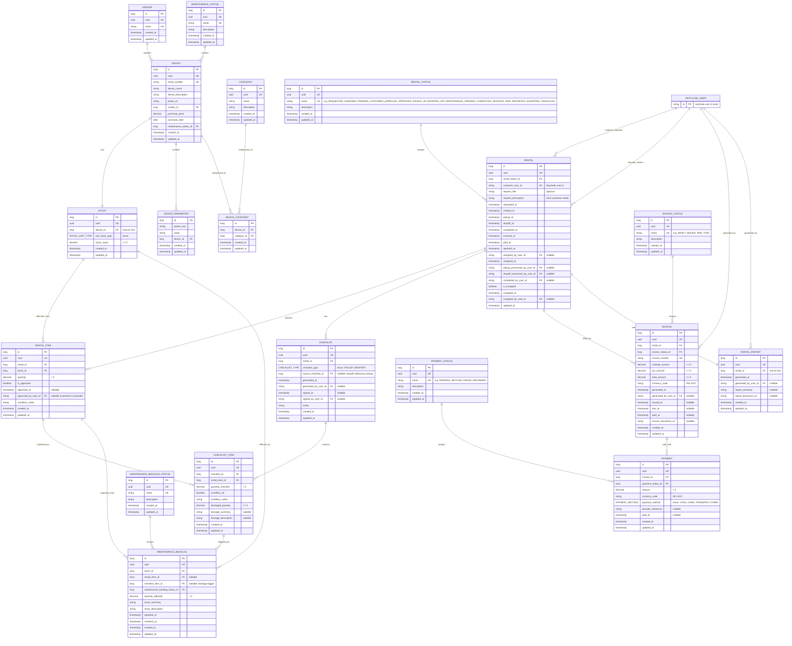

```mermaid
erDiagram
    VENDOR ||--o{ DEVICE : supplies
    MAINTENANCE_STATUS ||--o{ DEVICE : assigns

    DEVICE ||--|| STOCK : has
    DEVICE ||--o{ DEVICE_PARAMETER : contains

    DEVICE ||--o{ DEVICE_CATEGORY : categorized_as
    CATEGORY ||--o{ DEVICE_CATEGORY : categorized_as

    RENTAL_STATUS ||--o{ RENTAL : assigns
    KEYCLOAK_USER ||--o{ RENTAL : customer_requests
    KEYCLOAK_USER ||--o{ RENTAL : provider_actions

    RENTAL ||--o{ RENTAL_ITEM : contains
    STOCK ||--o{ RENTAL_ITEM : allocates_from

    RENTAL ||--o{ CHECKLIST : has
    CHECKLIST ||--o{ CHECKLIST_ITEM : contains
    RENTAL_ITEM ||--o{ CHECKLIST_ITEM : inspected_as

    MAINTENANCE_BACKLOG_STATUS ||--o{ MAINTENANCE_BACKLOG : assigns
    STOCK ||--o{ MAINTENANCE_BACKLOG : affected_by
    RENTAL_ITEM ||--o{ MAINTENANCE_BACKLOG : originates_from
    CHECKLIST_ITEM ||--o{ MAINTENANCE_BACKLOG : triggered_by

    RENTAL ||--o{ INVOICE : billed_by
    INVOICE_STATUS ||--o{ INVOICE : assigns
    KEYCLOAK_USER ||--o{ INVOICE : generated_by

    INVOICE ||--o{ PAYMENT : paid_with
    PAYMENT_STATUS ||--o{ PAYMENT : assigns

    RENTAL ||--|| RENTAL_REPORT : summarized_by
    KEYCLOAK_USER ||--o{ RENTAL_REPORT : generated_by

    VENDOR {
        long id PK
        uuid uuid UK
        string name UK
        timestamp created_at
        timestamp updated_at
    }

    CATEGORY {
        long id PK
        uuid uuid UK
        string name
        string description
        timestamp created_at
        timestamp updated_at
    }

    MAINTENANCE_STATUS {
        long id PK
        uuid uuid UK
        string name UK
        string description
        timestamp created_at
        timestamp updated_at
    }

    DEVICE {
        long id PK
        uuid uuid UK
        string serial_number UK
        string device_name
        string device_description
        string photo_url
        long vendor_id FK
        decimal purchase_price
        date purchase_date
        long maintenance_status_id FK
        timestamp created_at
        timestamp updated_at
    }

    STOCK {
        long id PK
        uuid uuid UK
        long device_id FK "One-to-One"
        STOCK_UNIT_TYPE unit_stock_type "enum"
        decimal stock_count ">= 0"
        timestamp created_at
        timestamp updated_at
    }

    DEVICE_PARAMETER {
        long id PK
        string param_key
        string value
        long device_id FK
        timestamp created_at
        timestamp updated_at
    }

    DEVICE_CATEGORY {
        long id PK
        long device_id FK
        long category_id FK
        timestamp created_at
        timestamp updated_at
    }

    KEYCLOAK_USER {
        string id PK "keycloak user id (sub)"
    }

    RENTAL_STATUS {
        long id PK
        uuid uuid UK
        string name UK "e.g. REQUESTED, ASSIGNED, PENDING_CUSTOMER_APPROVAL, APPROVED, PICKED_UP, DROPPED_OFF, MAINTENANCE_PENDING, COMPLETED, INVOICED, PAID, REPORTED, SCRAPPED, CANCELLED"
        string description
        timestamp created_at
        timestamp updated_at
    }

    RENTAL {
        long id PK
        uuid uuid UK

        long rental_status_id FK

        string customer_user_id FK "Keycloak user id"

        string request_title "optional"
        string request_description "what customer needs"
        timestamp requested_at

        timestamp created_at
        timestamp pickup_at
        timestamp dropoff_at
        timestamp completed_at
        timestamp invoiced_at
        timestamp paid_at
        timestamp reported_at

        string assigned_by_user_id FK "nullable"
        timestamp assigned_at

        string pickup_processed_by_user_id FK "nullable"
        string dropoff_processed_by_user_id FK "nullable"
        string completed_by_user_id FK "nullable"

        boolean is_scrapped
        timestamp scrapped_at
        string scrapped_by_user_id FK "nullable"

        timestamp updated_at
    }

    RENTAL_ITEM {
        long id PK
        uuid uuid UK
        long rental_id FK
        long stock_id FK
        decimal quantity " > 0"

        boolean is_approved
        timestamp approved_at "nullable"
        string approved_by_user_id FK "nullable (customer or provider)"

        string condition_notes

        timestamp created_at
        timestamp updated_at
    }

    CHECKLIST {
        long id PK
        uuid uuid UK
        long rental_id FK

        CHECKLIST_TYPE checklist_type "enum: PICKUP, DROPOFF"
        long source_checklist_id FK "nullable; dropoff references pickup"

        timestamp generated_at
        string generated_by_user_id FK "nullable"

        timestamp signed_at "nullable"
        string signed_by_user_id FK "nullable"

        string notes
        timestamp created_at
        timestamp updated_at
    }

    CHECKLIST_ITEM {
        long id PK
        uuid uuid UK
        long checklist_id FK
        long rental_item_id FK

        decimal quantity_checked " > 0"
        boolean condition_ok
        string condition_notes

        decimal damaged_quantity ">= 0"
        string damage_summary "nullable"
        string damage_description "nullable"

        timestamp created_at
        timestamp updated_at
    }

    MAINTENANCE_BACKLOG_STATUS {
        long id PK
        uuid uuid UK
        string name UK
        string description
        timestamp created_at
        timestamp updated_at
    }

    MAINTENANCE_BACKLOG {
        long id PK
        uuid uuid UK
        long stock_id FK
        long rental_item_id FK "nullable"
        long checklist_item_id FK "nullable; damage trigger"
        long maintenance_backlog_status_id FK
        decimal quantity_affected " > 0"
        string issue_summary
        string issue_description
        timestamp reported_at
        timestamp resolved_at
        timestamp created_at
        timestamp updated_at
    }

    %% step 6 & 7: invoicing, payment, report
    INVOICE_STATUS {
        long id PK
        uuid uuid UK
        string name UK "e.g. DRAFT, ISSUED, PAID, VOID"
        string description
        timestamp created_at
        timestamp updated_at
    }

    INVOICE {
        long id PK
        uuid uuid UK
        long rental_id FK

        long invoice_status_id FK
        string invoice_number UK

        decimal subtotal_amount ">= 0"
        decimal tax_amount ">= 0"
        decimal total_amount ">= 0"
        string currency_code "ISO 4217"

        timestamp generated_at
        string generated_by_user_id FK "nullable"
        timestamp issued_at "nullable"
        timestamp due_at "nullable"
        timestamp paid_at "nullable"

        string invoice_document_url "nullable"

        timestamp created_at
        timestamp updated_at
    }

    PAYMENT_STATUS {
        long id PK
        uuid uuid UK
        string name UK "e.g. PENDING, SETTLED, FAILED, REFUNDED"
        string description
        timestamp created_at
        timestamp updated_at
    }

    PAYMENT {
        long id PK
        uuid uuid UK
        long invoice_id FK
        long payment_status_id FK

        decimal amount " > 0"
        string currency_code "ISO 4217"
        PAYMENT_METHOD payment_method "enum: CASH, CARD, TRANSFER, OTHER"
        string provider_reference "nullable"

        timestamp paid_at "nullable"
        timestamp created_at
        timestamp updated_at
    }

    RENTAL_REPORT {
        long id PK
        uuid uuid UK
        long rental_id FK "one-to-one"

        timestamp generated_at
        string generated_by_user_id FK "nullable"
        string report_summary "nullable"
        string report_document_url "nullable"

        timestamp created_at
        timestamp updated_at
    }
```
