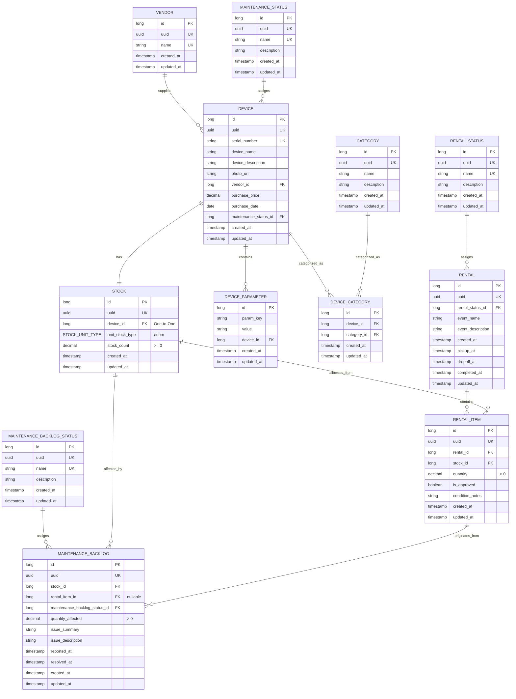

```mermaid
erDiagram
    VENDOR ||--o{ DEVICE : supplies
    MAINTENANCE_STATUS ||--o{ DEVICE : assigns

    DEVICE ||--|| STOCK : has
    DEVICE ||--o{ DEVICE_PARAMETER : contains

    DEVICE ||--o{ DEVICE_CATEGORY : categorized_as
    CATEGORY ||--o{ DEVICE_CATEGORY : categorized_as

    RENTAL_STATUS ||--o{ RENTAL : assigns
    RENTAL ||--o{ RENTAL_ITEM : contains
    STOCK ||--o{ RENTAL_ITEM : allocates_from

    MAINTENANCE_BACKLOG_STATUS ||--o{ MAINTENANCE_BACKLOG : assigns
    STOCK ||--o{ MAINTENANCE_BACKLOG : affected_by
    RENTAL_ITEM ||--o{ MAINTENANCE_BACKLOG : originates_from

    VENDOR {
        long id PK
        uuid uuid UK
        string name UK
        timestamp created_at
        timestamp updated_at
    }

    CATEGORY {
        long id PK
        uuid uuid UK
        string name
        string description
        timestamp created_at
        timestamp updated_at
    }

    MAINTENANCE_STATUS {
        long id PK
        uuid uuid UK
        string name UK
        string description
        timestamp created_at
        timestamp updated_at
    }

    DEVICE {
        long id PK
        uuid uuid UK
        string serial_number UK
        string device_name
        string device_description
        string photo_url
        long vendor_id FK
        decimal purchase_price
        date purchase_date
        long maintenance_status_id FK
        timestamp created_at
        timestamp updated_at
    }

    STOCK {
        long id PK
        uuid uuid UK
        long device_id FK "One-to-One"
        STOCK_UNIT_TYPE unit_stock_type "enum"
        decimal stock_count ">= 0"
        timestamp created_at
        timestamp updated_at
    }

    DEVICE_PARAMETER {
        long id PK
        string param_key
        string value
        long device_id FK
        timestamp created_at
        timestamp updated_at
    }

    DEVICE_CATEGORY {
        long id PK
        long device_id FK
        long category_id FK
        timestamp created_at
        timestamp updated_at
    }

    RENTAL_STATUS {
        long id PK
        uuid uuid UK
        string name UK
        string description
        timestamp created_at
        timestamp updated_at
    }

    RENTAL {
        long id PK
        uuid uuid UK
        long rental_status_id FK
        string event_name
        string event_description
        timestamp created_at
        timestamp pickup_at
        timestamp dropoff_at
        timestamp completed_at
        timestamp updated_at
    }

    RENTAL_ITEM {
        long id PK
        uuid uuid UK
        long rental_id FK
        long stock_id FK
        decimal quantity " > 0"
        boolean is_approved
        string condition_notes
        timestamp created_at
        timestamp updated_at
    }

    MAINTENANCE_BACKLOG_STATUS {
        long id PK
        uuid uuid UK
        string name UK
        string description
        timestamp created_at
        timestamp updated_at
    }

    MAINTENANCE_BACKLOG {
        long id PK
        uuid uuid UK
        long stock_id FK
        long rental_item_id FK "nullable"
        long maintenance_backlog_status_id FK
        decimal quantity_affected " > 0"
        string issue_summary
        string issue_description
        timestamp reported_at
        timestamp resolved_at
        timestamp created_at
        timestamp updated_at
    }
```
